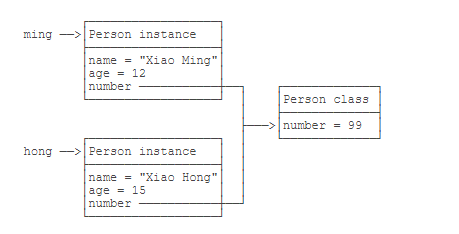

<!-- START doctoc generated TOC please keep comment here to allow auto update -->
<!-- DON'T EDIT THIS SECTION, INSTEAD RE-RUN doctoc TO UPDATE -->


- [面向对象 OOP（Object-Oriented Programming）](#%E9%9D%A2%E5%90%91%E5%AF%B9%E8%B1%A1-oopobject-oriented-programming)
  - [1. 面向对象基础](#1-%E9%9D%A2%E5%90%91%E5%AF%B9%E8%B1%A1%E5%9F%BA%E7%A1%80)
    - [1.1 构造方法](#11-%E6%9E%84%E9%80%A0%E6%96%B9%E6%B3%95)
    - [1.2 方法重载](#12-%E6%96%B9%E6%B3%95%E9%87%8D%E8%BD%BD)
    - [1.3 继承](#13-%E7%BB%A7%E6%89%BF)
    - [1.4 多态](#14-%E5%A4%9A%E6%80%81)
      - [1.4.1 覆写Object方法](#141-%E8%A6%86%E5%86%99object%E6%96%B9%E6%B3%95)
      - [1.4.2 调用super](#142-%E8%B0%83%E7%94%A8super)
      - [1.4.3 final](#143-final)
    - [1.5 抽象类](#15-%E6%8A%BD%E8%B1%A1%E7%B1%BB)
      - [1.5.1 定义](#151-%E5%AE%9A%E4%B9%89)
      - [1.5.2 意义](#152-%E6%84%8F%E4%B9%89)
      - [1.5.3 面向抽象编程](#153-%E9%9D%A2%E5%90%91%E6%8A%BD%E8%B1%A1%E7%BC%96%E7%A8%8B)
      - [1.5.4 总结](#154-%E6%80%BB%E7%BB%93)
    - [1.6 接口](#16-%E6%8E%A5%E5%8F%A3)
      - [1.6.1 定义](#161-%E5%AE%9A%E4%B9%89)
      - [1.6.2 default方法](#162-default%E6%96%B9%E6%B3%95)
      - [1.6.3 总结](#163-%E6%80%BB%E7%BB%93)
    - [1.7 静态字段和方法](#17-%E9%9D%99%E6%80%81%E5%AD%97%E6%AE%B5%E5%92%8C%E6%96%B9%E6%B3%95)
      - [1.7.1 静态字段](#171-%E9%9D%99%E6%80%81%E5%AD%97%E6%AE%B5)
      - [1.7.2 静态方法](#172-%E9%9D%99%E6%80%81%E6%96%B9%E6%B3%95)
      - [1.7.3 接口的静态字段](#173-%E6%8E%A5%E5%8F%A3%E7%9A%84%E9%9D%99%E6%80%81%E5%AD%97%E6%AE%B5)
      - [1.7.4 总结](#174-%E6%80%BB%E7%BB%93)
    - [1.8 包](#18-%E5%8C%85)
    - [1.9 作用域](#19-%E4%BD%9C%E7%94%A8%E5%9F%9F)
    - [1.10 内部类](#110-%E5%86%85%E9%83%A8%E7%B1%BB)
    - [1.11 classpath和jar](#111-classpath%E5%92%8Cjar)
    - [1.12 模块](#112-%E6%A8%A1%E5%9D%97)
  - [2. 面向对象-核心类](#2-%E9%9D%A2%E5%90%91%E5%AF%B9%E8%B1%A1-%E6%A0%B8%E5%BF%83%E7%B1%BB)

<!-- END doctoc generated TOC please keep comment here to allow auto update -->

# 面向对象 OOP（Object-Oriented Programming）
## 1. 面向对象基础
### 1.1 构造方法
构造方法和类名相同，且可以有多个不同参数的构造方法。
### 1.2 方法重载
在一个类中，我们可以定义多个方法。如果有一系列方法，它们的功能都是类似的，只有参数有所不同，那么，可以把这一组方法名做成同名方法。例如，在Hello类中，定义多个hello()方法：
```java
    class Hello {
        public void hello() {
            System.out.println("Hello, world!");
        }

        public void hello(String name) {
            System.out.println("Hello, " + name + "!");
        }

        public void hello(String name, int age) {
            if (age < 18) {
                System.out.println("Hi, " + name + "!");
            } else {
                System.out.println("Hello, " + name + "!");
            }
        }
    }
```
这种方法名相同，但各自的参数不同，称为方法重载（Overload）。

注意：方法重载的返回值类型通常都是相同的。

方法重载的目的是，功能类似的方法使用同一名字，更容易记住，因此，调用起来更简单。

### 1.3 继承


Java只允许一个class继承自一个类，因此，一个类有且仅有一个父类。只有Object特殊，它没有父类。

总结：
1. 继承是面向对象编程的一种强大的代码复用方式； 
2. Java只允许单继承，所有类最终的根类是Object； 
3. protected允许子类访问父类的字段和方法； 
4. 子类的构造方法可以通过super()调用父类的构造方法； 
5. 可以安全地向上转型为更抽象的类型； 
6. 可以强制向下转型，最好借助instanceof判断； 
7. 子类和父类的关系是is，has关系不能用继承

### 1.4 多态
多态是指，针对某个类型的方法调用，其真正执行的方法取决于运行时期实际类型的方法。例如：
```java
    Person p = new Student();
    p.run(); // 无法确定运行时究竟调用哪个run()方法
```
有童鞋会问，从上面的代码一看就明白，肯定调用的是Student的run()方法啊。

但是，假设我们编写这样一个方法：
```java
    public void runTwice(Person p) {
        p.run();
        p.run();
    }
```
它传入的参数类型是Person，我们是无法知道传入的参数实际类型究竟是Person，还是Student，还是Person的其他子类，因此，也无法确定调用的是不是Person类定义的run()方法。

所以，多态的特性就是，运行期才能动态决定调用的子类方法。对某个类型调用某个方法，执行的实际方法可能是某个子类的覆写方法。

#### 1.4.1 覆写Object方法

因为所有的class最终都继承自Object，而Object定义了几个重要的方法：
    
    toString()：把instance输出为String；
    equals()：判断两个instance是否逻辑相等；
    hashCode()：计算一个instance的哈希值。

在必要的情况下，我们可以覆写Object的这几个方法。例如：
```java
    class Person {
        ...
        // 显示更有意义的字符串:
        @Override
        public String toString() {
            return "Person:name=" + name;
        }
    
        // 比较是否相等:
        @Override
        public boolean equals(Object o) {
            // 当且仅当o为Person类型:
            if (o instanceof Person) {
                Person p = (Person) o;
                // 并且name字段相同时，返回true:
                return this.name.equals(p.name);
            }
            return false;
        }
        // 计算hash:
        @Override
        public int hashCode() {
            return this.name.hashCode();
        }
    }
```
#### 1.4.2 调用super
在子类的覆写方法中，如果要调用父类的被覆写的方法，可以通过super来调用。例如：
```java
    class Person {
        protected String name;
        public String hello() {
            return "Hello, " + name;
        }
    }
    
    Student extends Person {
        @Override
        public String hello() {
            // 调用父类的hello()方法:
            return super.hello() + "!";
        }
    }
```
#### 1.4.3 final
继承可以允许子类覆写父类的方法。如果一个父类不允许子类对它的某个方法进行覆写，可以把该方法标记为final。用final修饰的方法不能被Override：
```java
    class Person {
        protected String name;
        public final String hello() {
            return "Hello, " + name;
        }
    }
    
    Student extends Person {
        // compile error: 不允许覆写
        @Override
        public String hello() {
        }
    }
```
如果一个类不希望任何其他类继承自它，那么可以把这个类本身标记为final。用final修饰的类不能被继承：
```java
    final class Person {
        protected String name;
    }
    
    // compile error: 不允许继承自Person
    Student extends Person {
    }
```
总结：

* 子类可以覆写父类的方法（Override），覆写在子类中改变了父类方法的行为； 
* Java的方法调用总是作用于运行期对象的实际类型，这种行为称为多态； 
* final修饰符有多种作用： 
  * final修饰的方法可以阻止被覆写； 
  * final修饰的class可以阻止被继承； 
  * final修饰的field必须在创建对象时初始化，随后不可修改。

### 1.5 抽象类
    如果父类的方法本身不需要实现任何功能，仅仅是为了定义方法签名，目的是让子类去覆写它，那么，可以把父类的方法声明为抽象方法。
```java
class Person {
    public abstract void run();
}
```

把一个方法声明为abstract，表示它是一个抽象方法，本身没有实现任何方法语句。因为这个抽象方法本身是无法执行的，所以，Person类也无法被实例化。编译器会告诉我们，无法编译Person类，因为它包含抽象方法。

必须把Person类本身也声明为abstract，才能正确编译它：
```java
abstract class Person {
    public abstract void run();
}
```
#### 1.5.1 定义

如果一个class定义了方法，但没有具体执行代码，这个方法就是抽象方法，抽象方法用abstract修饰。

因为无法执行抽象方法，因此这个类也必须申明为抽象类（abstract class）。

使用abstract修饰的类就是抽象类。我们无法实例化一个抽象类。

#### 1.5.2 意义

因为抽象类本身被设计成只能用于被继承，因此，抽象类可以强迫子类实现其定义的抽象方法，否则编译会报错。因此，抽象方法实际上相当于定义了“规范”。

#### 1.5.3 面向抽象编程

当我们定义了抽象类Person，以及具体的Student、Teacher子类的时候，我们可以通过抽象类Person类型去引用具体的子类的实例：

```java
Person s = new Student();
Person t = new Teacher();
```
这种引用抽象类的好处在于，我们对其进行方法调用，并不关心Person类型变量的具体子类型：

```java
// 不关心Person变量的具体子类型:
s.run();
t.run();
```

同样的代码，如果引用的是一个新的子类，我们仍然不关心具体类型：

```java
// 同样不关心新的子类是如何实现run()方法的：
Person e = new Employee();
e.run();
```

这种尽量引用高层类型，避免引用实际子类型的方式，称之为面向抽象编程。

面向抽象编程的本质就是：
- 上层代码只定义规范（例如：abstract class Person）；
- 不需要子类就可以实现业务逻辑（正常编译）；
- 具体的业务逻辑由不同的子类实现，调用者并不关心。

#### 1.5.4 总结
- 通过abstract定义的方法是抽象方法，它只有定义，没有实现。抽象方法定义了子类必须实现的接口规范； 
- 定义了抽象方法的class必须被定义为抽象类，从抽象类继承的子类必须实现抽象方法； 
- 如果不实现抽象方法，则该子类仍是一个抽象类； 
- 面向抽象编程使得调用者只关心抽象方法的定义，不关心子类的具体实现。

### 1.6 接口

#### 1.6.1 定义
在抽象类中，抽象方法本质上是定义接口规范：即规定高层类的接口，从而保证所有子类都有相同的接口实现，这样，多态就能发挥出威力。

如果一个抽象类没有字段，所有方法全部都是抽象方法：
```java
abstract class Person {
  public abstract void run();
  public abstract String getName();
}
```

就可以把该抽象类改写为接口：interface。

在Java中，使用interface可以声明一个接口：

```java
interface Person {
  void run();
  String getName();
}
```

所谓interface，就是比抽象类还要抽象的纯抽象接口，因为它连字段都不能有。因为接口定义的所有方法默认都是public abstract的，所以这两个修饰符不需要写出来（写不写效果都一样）。

当一个具体的class去实现一个interface时，需要使用implements关键字。举个例子：

```java
class Student implements Person {
private String name;

    public Student(String name) {
        this.name = name;
    }

    @Override
    public void run() {
        System.out.println(this.name + " run");
    }

    @Override
    public String getName() {
        return this.name;
    }
}
```

我们知道，在Java中，一个类只能继承自另一个类，不能从多个类继承。但是，一个类可以实现多个interface，例如：

```java
class Student implements Person, Hello { // 实现了两个interface
...
}
```
抽象类和接口的对比如下：

| |abstract class|interface|
| ---- | ---- | ---- |
| 继承	| 只能extends一个class	| 可以implements多个interface
| 字段	| 可以定义实例字段	| 不能定义实例字段
| 抽象方法	| 可以定义抽象方法	| 可以定义抽象方法
| 非抽象方法	| 可以定义非抽象方法	| 可以定义default方法

#### 1.6.2 default方法
在接口中，可以定义default方法。例如，把Person接口的run()方法改为default方法：
```java
public class Main {
    public static void main(String[] args) {
        Person p = new Student("Xiao Ming");
        p.run();
    }
}

interface Person {
    String getName();
    default void run() {
        System.out.println(getName() + " run");
    }
}

class Student implements Person {
    private String name;

    public Student(String name) {
        this.name = name;
    }

    public String getName() {
        return this.name;
    }
}
```
实现类可以不必覆写default方法。

default方法的目的是，当我们需要给接口新增一个方法时，会涉及到修改全部子类。如果新增的是default方法，那么子类就不必全部修改，只需要在需要覆写的地方去覆写新增方法。

default方法和抽象类的普通方法是有所不同的。因为interface没有字段，default方法无法访问字段，而抽象类的普通方法可以访问实例字段。

#### 1.6.3 总结
- Java的接口（interface）定义了纯抽象规范，一个类可以实现多个接口； 
- 接口也是数据类型，适用于向上转型和向下转型； 
- 接口的所有方法都是抽象方法，接口不能定义实例字段； 
- 接口可以定义default方法（JDK>=1.8）。

### 1.7 静态字段和方法

#### 1.7.1 静态字段

在一个class中定义的字段，我们称之为实例字段。实例字段的特点是，每个实例都有独立的字段，各个实例的同名字段互不影响。

还有一种字段，是用`static`修饰的字段，称为静态字段：`static field`。

实例字段在每个实例中都有自己的一个独立“空间”，但是静态字段只有一个共享“空间”，所有实例都会共享该字段。  

对于静态字段，无论修改哪个实例的静态字段，效果都是一样的：所有实例的静态字段都被修改了，原因是静态字段并不属于实例：  



虽然实例可以访问静态字段，但是它们指向的其实都是`Person class`的静态字段。所以，所有实例共享一个静态字段。

因此，不推荐用`实例变量.静态字段`去访问静态字段，因为在Java程序中，实例对象并没有静态字段。在代码中，实例对象能访问静态字段只是因为编译器可以根据实例类型自动转换为`类名.静态字段`来访问静态对象。

推荐用类名来访问静态字段。可以把静态字段理解为描述`class`本身的字段（非实例字段）。对于上面的代码，更好的写法是：

```java
Person.number = 99;
System.out.println(Person.number);
```
#### 1.7.2 静态方法
有静态字段，就有静态方法。用`static`修饰的方法称为静态方法。

调用实例方法必须通过一个实例变量，而调用静态方法则不需要实例变量，通过类名就可以调用。静态方法类似其它编程语言的函数。
```java
public class Main {
    public static void main(String[] args) {
        Person.setNumber(99);
        System.out.println(Person.number);
    }
}

class Person {
    public static int number;

    public static void setNumber(int value) {
        number = value;
    }
}
```

因为静态方法属于`class`而不属于实例，因此，静态方法内部，无法访问`this`变量，也无法访问实例字段，它只能访问静态字段。

通过实例变量也可以调用静态方法，但这只是编译器自动帮我们把实例改写成类名而已。

通常情况下，通过实例变量访问静态字段和静态方法，会得到一个编译警告。

静态方法经常用于工具类。例如：

- Arrays.sort()
- Math.random()

静态方法也经常用于辅助方法。注意到Java程序的入口`main()`也是静态方法。

#### 1.7.3 接口的静态字段
因为`interface`是一个纯抽象类，所以它不能定义实例字段。但是，interface是可以有静态字段的，并且静态字段必须为`final`类型：

```java
public interface Person {
  public static final int MALE = 1;
  public static final int FEMALE = 2;
}
```

实际上，因为`interface`的字段只能是`public static final`类型，所以我们可以把这些修饰符都去掉，上述代码可以简写为：

```java
public interface Person {
  // 编译器会自动加上public statc final:
  int MALE = 1;
  int FEMALE = 2;
}
```

编译器会自动把该字段变为`public static final`类型。

#### 1.7.4 总结
- 静态字段属于所有实例“共享”的字段，实际上是属于class的字段； 
- 调用静态方法不需要实例，无法访问this，但可以访问静态字段和其他静态方法； 
- 静态方法常用于工具类和辅助方法。

### 1.8 包
### 1.9 作用域
### 1.10 内部类
### 1.11 classpath和jar
### 1.12 模块

## 2. 面向对象-核心类