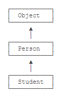

- [面向对象 OOP（Object-Oriented Programming）](#%E9%9D%A2%E5%90%91%E5%AF%B9%E8%B1%A1-oopobject-oriented-programming)
  - [1. 面向对象基础](#1-%E9%9D%A2%E5%90%91%E5%AF%B9%E8%B1%A1%E5%9F%BA%E7%A1%80)
    - [1.1 构造方法](#11-%E6%9E%84%E9%80%A0%E6%96%B9%E6%B3%95)
    - [1.2 方法重载](#12-%E6%96%B9%E6%B3%95%E9%87%8D%E8%BD%BD)
    - [1.3 继承](#13-%E7%BB%A7%E6%89%BF)
    - [1.4 多态](#14-%E5%A4%9A%E6%80%81)
      - [1.4.1 覆写Object方法](#141-%E8%A6%86%E5%86%99object%E6%96%B9%E6%B3%95)
      - [1.4.2 调用super](#142-%E8%B0%83%E7%94%A8super)
      - [1.4.3 final](#143-final)
    - [1.5 抽象类](#15-%E6%8A%BD%E8%B1%A1%E7%B1%BB)
    - [1.6 接口](#16-%E6%8E%A5%E5%8F%A3)
    - [1.7 静态字段和方法](#17-%E9%9D%99%E6%80%81%E5%AD%97%E6%AE%B5%E5%92%8C%E6%96%B9%E6%B3%95)
    - [1.8 包](#18-%E5%8C%85)
    - [1.9 作用域](#19-%E4%BD%9C%E7%94%A8%E5%9F%9F)
    - [1.10 内部类](#110-%E5%86%85%E9%83%A8%E7%B1%BB)
    - [1.11 classpath和jar](#111-classpath%E5%92%8Cjar)
    - [1.12 模块](#112-%E6%A8%A1%E5%9D%97)
  - [2. 面向对象-核心类](#2-%E9%9D%A2%E5%90%91%E5%AF%B9%E8%B1%A1-%E6%A0%B8%E5%BF%83%E7%B1%BB)

# 面向对象 OOP（Object-Oriented Programming）
## 1. 面向对象基础
### 1.1 构造方法
构造方法和类名相同，且可以有多个不同参数的构造方法。
### 1.2 方法重载
在一个类中，我们可以定义多个方法。如果有一系列方法，它们的功能都是类似的，只有参数有所不同，那么，可以把这一组方法名做成同名方法。例如，在Hello类中，定义多个hello()方法：
```java
    class Hello {
        public void hello() {
            System.out.println("Hello, world!");
        }

        public void hello(String name) {
            System.out.println("Hello, " + name + "!");
        }

        public void hello(String name, int age) {
            if (age < 18) {
                System.out.println("Hi, " + name + "!");
            } else {
                System.out.println("Hello, " + name + "!");
            }
        }
    }
```
这种方法名相同，但各自的参数不同，称为方法重载（Overload）。

注意：方法重载的返回值类型通常都是相同的。

方法重载的目的是，功能类似的方法使用同一名字，更容易记住，因此，调用起来更简单。

### 1.3 继承



Java只允许一个class继承自一个类，因此，一个类有且仅有一个父类。只有Object特殊，它没有父类。

总结：
1. 继承是面向对象编程的一种强大的代码复用方式； 
2. Java只允许单继承，所有类最终的根类是Object； 
3. protected允许子类访问父类的字段和方法； 
4. 子类的构造方法可以通过super()调用父类的构造方法； 
5. 可以安全地向上转型为更抽象的类型； 
6. 可以强制向下转型，最好借助instanceof判断； 
7. 子类和父类的关系是is，has关系不能用继承

### 1.4 多态
多态是指，针对某个类型的方法调用，其真正执行的方法取决于运行时期实际类型的方法。例如：
```java
    Person p = new Student();
    p.run(); // 无法确定运行时究竟调用哪个run()方法
```
有童鞋会问，从上面的代码一看就明白，肯定调用的是Student的run()方法啊。

但是，假设我们编写这样一个方法：
```java
    public void runTwice(Person p) {
        p.run();
        p.run();
    }
```
它传入的参数类型是Person，我们是无法知道传入的参数实际类型究竟是Person，还是Student，还是Person的其他子类，因此，也无法确定调用的是不是Person类定义的run()方法。

所以，多态的特性就是，运行期才能动态决定调用的子类方法。对某个类型调用某个方法，执行的实际方法可能是某个子类的覆写方法。

#### 1.4.1 覆写Object方法

因为所有的class最终都继承自Object，而Object定义了几个重要的方法：
    
    toString()：把instance输出为String；
    equals()：判断两个instance是否逻辑相等；
    hashCode()：计算一个instance的哈希值。

在必要的情况下，我们可以覆写Object的这几个方法。例如：
```java
    class Person {
        ...
        // 显示更有意义的字符串:
        @Override
        public String toString() {
            return "Person:name=" + name;
        }
    
        // 比较是否相等:
        @Override
        public boolean equals(Object o) {
            // 当且仅当o为Person类型:
            if (o instanceof Person) {
                Person p = (Person) o;
                // 并且name字段相同时，返回true:
                return this.name.equals(p.name);
            }
            return false;
        }
        // 计算hash:
        @Override
        public int hashCode() {
            return this.name.hashCode();
        }
    }
```
#### 1.4.2 调用super
在子类的覆写方法中，如果要调用父类的被覆写的方法，可以通过super来调用。例如：
```java
    class Person {
        protected String name;
        public String hello() {
            return "Hello, " + name;
        }
    }
    
    Student extends Person {
        @Override
        public String hello() {
            // 调用父类的hello()方法:
            return super.hello() + "!";
        }
    }
```
#### 1.4.3 final
继承可以允许子类覆写父类的方法。如果一个父类不允许子类对它的某个方法进行覆写，可以把该方法标记为final。用final修饰的方法不能被Override：
```java
    class Person {
        protected String name;
        public final String hello() {
            return "Hello, " + name;
        }
    }
    
    Student extends Person {
        // compile error: 不允许覆写
        @Override
        public String hello() {
        }
    }
```
如果一个类不希望任何其他类继承自它，那么可以把这个类本身标记为final。用final修饰的类不能被继承：
```java
    final class Person {
        protected String name;
    }
    
    // compile error: 不允许继承自Person
    Student extends Person {
    }
```
总结：

* 子类可以覆写父类的方法（Override），覆写在子类中改变了父类方法的行为； 
* Java的方法调用总是作用于运行期对象的实际类型，这种行为称为多态； 
* final修饰符有多种作用： 
  * final修饰的方法可以阻止被覆写； 
  * final修饰的class可以阻止被继承； 
  * final修饰的field必须在创建对象时初始化，随后不可修改。

### 1.5 抽象类
    如果父类的方法本身不需要实现任何功能，仅仅是为了定义方法签名，目的是让子类去覆写它，那么，可以把父类的方法声明为抽象方法。
### 1.6 接口
### 1.7 静态字段和方法
### 1.8 包
### 1.9 作用域
### 1.10 内部类
### 1.11 classpath和jar
### 1.12 模块

## 2. 面向对象-核心类