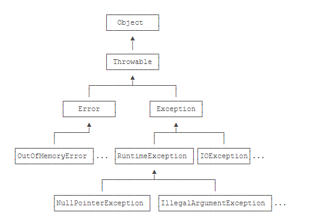
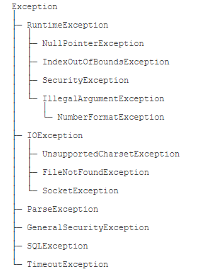

<!-- START doctoc generated TOC please keep comment here to allow auto update -->
<!-- DON'T EDIT THIS SECTION, INSTEAD RE-RUN doctoc TO UPDATE -->


- [1. 异常处理](#1-%E5%BC%82%E5%B8%B8%E5%A4%84%E7%90%86)
  - [1.1 Java的异常](#11-java%E7%9A%84%E5%BC%82%E5%B8%B8)
    - [Java规定](#java%E8%A7%84%E5%AE%9A)
    - [总结](#%E6%80%BB%E7%BB%93)
  - [1.2 捕获异常](#12-%E6%8D%95%E8%8E%B7%E5%BC%82%E5%B8%B8)
    - [1.2.1 说明](#121-%E8%AF%B4%E6%98%8E)
    - [1.2.2 finally语句](#122-finally%E8%AF%AD%E5%8F%A5)
    - [1.2.3 捕获多种异常](#123-%E6%8D%95%E8%8E%B7%E5%A4%9A%E7%A7%8D%E5%BC%82%E5%B8%B8)
    - [1.2.4 总结](#124-%E6%80%BB%E7%BB%93)
  - [1.3 抛出异常](#13-%E6%8A%9B%E5%87%BA%E5%BC%82%E5%B8%B8)
    - [1.3.1 异常的传播](#131-%E5%BC%82%E5%B8%B8%E7%9A%84%E4%BC%A0%E6%92%AD)
    - [1.3.2 抛出异常](#132-%E6%8A%9B%E5%87%BA%E5%BC%82%E5%B8%B8)
    - [1.3.3 总结](#133-%E6%80%BB%E7%BB%93)
  - [1.4 自定义异常](#14-%E8%87%AA%E5%AE%9A%E4%B9%89%E5%BC%82%E5%B8%B8)
    - [总结](#%E6%80%BB%E7%BB%93-1)
  - [1.5 NullPointerException](#15-nullpointerexception)
  - [1.6 使用断言](#16-%E4%BD%BF%E7%94%A8%E6%96%AD%E8%A8%80)
  - [1.7 使用JDK Logging](#17-%E4%BD%BF%E7%94%A8jdk-logging)
  - [1.8 使用Commons Logging](#18-%E4%BD%BF%E7%94%A8commons-logging)
  - [1.9 使用Log4j](#19-%E4%BD%BF%E7%94%A8log4j)
  - [1.10 使用Log4j和logback](#110-%E4%BD%BF%E7%94%A8log4j%E5%92%8Clogback)

<!-- END doctoc generated TOC please keep comment here to allow auto update -->

# 1. 异常处理

## 1.1 Java的异常

`Java`内置了一套异常处理机制，总是使用异常来表示错误。

异常是一种`class`，因此它本身带有类型信息。异常可以在任何地方抛出，但只需要在上层捕获。格式：
```java
try {
    String s = processFile(“C:\\test.txt”);
    // ok:
} catch (FileNotFoundException e) {
    // file not found:
} catch (SecurityException e) {
    // no read permission:
} catch (IOException e) {
    // io error:
} catch (Exception e) {
    // other error:
}
```
异常继承树：



`Throwable`有两个体系：`Error`和`Exception`，`Error`表示严重的错误，程序对此一般无能为力，例如：

- `OutOfMemoryError`：内存耗尽
- `NoClassDefFoundError`：无法加载某个Class
- `StackOverflowError`：栈溢出

而`Exception`则是运行时的错误，它可以被捕获并处理。

某些异常是应用程序逻辑处理的一部分，应该捕获并处理。例如：

- `NumberFormatException`：数值类型的格式错误
- `FileNotFoundException`：未找到文件
- `SocketException`：读取网络失败

`Exception`又分为两大类：

- `RuntimeException`以及它的子类；
- 非`RuntimeException`（包括`IOException`、`ReflectiveOperationException`等等）

### Java规定

- 必须捕获的异常，包括`Exception`及其子类，但不包括`RuntimeException`及其子类，这种类型的异常称为`Checked Exception`。

- 不需要捕获的异常，包括`Error`及其子类，`RuntimeException`及其子类。

**注意：编译器对RuntimeException及其子类不做强制捕获要求，不是指应用程序本身不应该捕获并处理RuntimeException。是否需要捕获，具体问题具体分析。**

### 总结

- Java使用异常来表示错误，并通过try ... catch捕获异常；

- Java的异常是class，并且从Throwable继承；

- Error是无需捕获的严重错误，Exception是应该捕获的可处理的错误；

- RuntimeException无需强制捕获，非RuntimeException（Checked Exception）需强制捕获，或者用throws声明；

- 不推荐捕获了异常但不进行任何处理。

## 1.2 捕获异常

### 1.2.1 说明

在`Java`中，凡是可能抛出异常的语句，都可以用`try ... catch`捕获。把可能发生异常的语句放在`try { ... }`中，然后使用`catch`捕获对应的`Exception`及其子类。

```java
public static void main(String[] args) {
    try {
        process1();
        process2();
        process3();
    } catch (IOException e) {
        System.out.println(e);
    } catch (NumberFormatException e) {
        System.out.println(e);
    }
}
```
注意：多个`catch`语句只有一个能被执行。

存在多个catch的时候，catch的顺序非常重要：**子类必须写在前面**。

可以使用多个catch语句，每个catch分别捕获对应的Exception及其子类。JVM在捕获到异常后，会从上到下匹配catch语句，匹配到某个catch后，执行catch代码块，然后不再继续匹配。

### 1.2.2 finally语句
`finally`语句块保证有无错误都会执行。
```java
public static void main(String[] args) {
    try {
        process1();
        process2();
        process3();
    } catch (UnsupportedEncodingException e) {
        System.out.println("Bad encoding");
    } catch (IOException e) {
        System.out.println("IO error");
    } finally {
        System.out.println("END");
    }
}
```

finally特点：

1. finally语句不是必须的，可写可不写； 
2. finally总是最后执行。

### 1.2.3 捕获多种异常
```java
public static void main(String[] args) {
    try {
        process1();
        process2();
        process3();
    } catch (IOException | NumberFormatException e) { // IOException或NumberFormatException
        System.out.println("Bad input");
    } catch (Exception e) {
        System.out.println("Unknown error");
    }
}
```

因为处理`IOException`和`NumberFormatException`的代码是相同的，所以我们可以把它两用`|`合并到一起。

### 1.2.4 总结

使用`try ... catch ... finally`时：

- 多个catch语句的匹配顺序非常重要，子类必须放在前面；

- finally语句保证了有无异常都会执行，它是可选的；

- 一个catch语句也可以匹配多个非继承关系的异常。

## 1.3 抛出异常
### 1.3.1 异常的传播
当某个方法抛出了异常时，如果当前方法没有捕获异常，异常就会被抛到上层调用方法，直到遇到某个`try ... catch`被捕获为止：

```java
public class Main {
    public static void main(String[] args) {
        try {
            process1();
        } catch (Exception e) {
            e.printStackTrace();
        }
    }

    static void process1() {
        process2();
    }

    static void process2() {
        Integer.parseInt(null); // 会抛出NumberFormatException
    }
}
```
### 1.3.2 抛出异常
抛出异常分两步：

1. 创建某个Exception的实例； 
2. 用throw语句抛出。

```java
void process2(String s) {
    if (s==null) {
        throw new NullPointerException();
    }
}
```

### 1.3.3 总结
- 调用printStackTrace()可以打印异常的传播栈，对于调试非常有用；

- 捕获异常并再次抛出新的异常时，应该持有原始异常信息；

- 通常不要在finally中抛出异常。如果在finally中抛出异常，应该原始异常加入到原有异常中。调用方可通过Throwable.getSuppressed()获取所有添加的Suppressed Exception。

## 1.4 自定义异常

Java标准库定义的常用异常包括：



在一个大型项目中，可以自定义新的异常类型，但是，保持一个合理的异常继承体系是非常重要的。

一个常见的做法是自定义一个`BaseException`作为“`根异常`”，然后，派生出各种业务类型的异常。

`BaseException`需要从一个适合的`Exception`派生，通常建议从`RuntimeException`派生：

```java
public class BaseException extends RuntimeException {
}
```

其他业务类型的异常就可以从`BaseException`派生：

```java
public class UserNotFoundException extends BaseException {
}

public class LoginFailedException extends BaseException {
}

...
```

自定义的`BaseException`应该提供多个构造方法：
```java
public class BaseException extends RuntimeException {
    public BaseException() {
        super();
    }

    public BaseException(String message, Throwable cause) {
        super(message, cause);
    }

    public BaseException(String message) {
        super(message);
    }

    public BaseException(Throwable cause) {
        super(cause);
    }
}
```

上述构造方法实际上都是原样照抄`RuntimeException`。这样，抛出异常的时候，就可以选择合适的构造方法。通过`IDE`可以根据父类快速生成子类的构造方法。

### 总结
- 抛出异常时，尽量复用JDK已定义的异常类型；

- 自定义异常体系时，推荐从RuntimeException派生“根异常”，再派生出业务异常；

- 自定义异常时，应该提供多种构造方法。

## 1.5 NullPointerException
## 1.6 使用断言
## 1.7 使用JDK Logging
## 1.8 使用Commons Logging
## 1.9 使用Log4j
## 1.10 使用Log4j和logback
